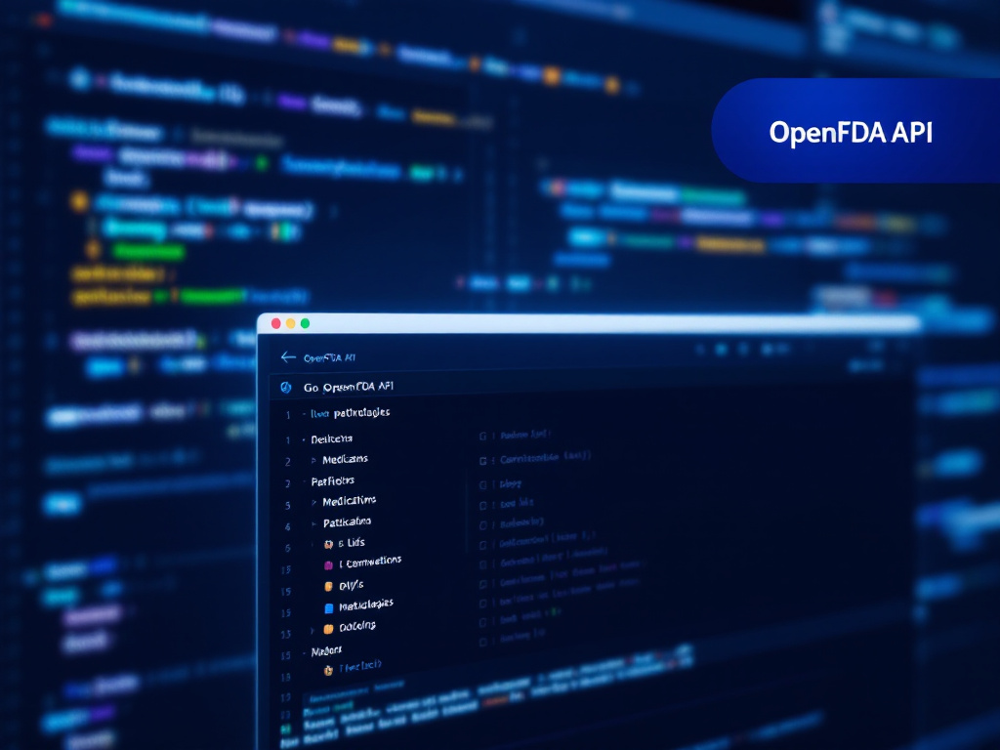
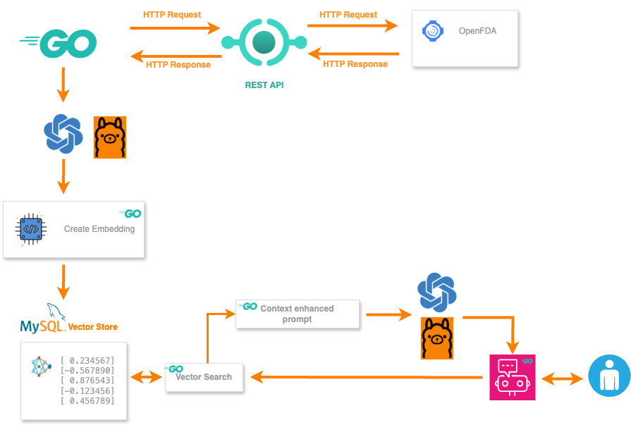
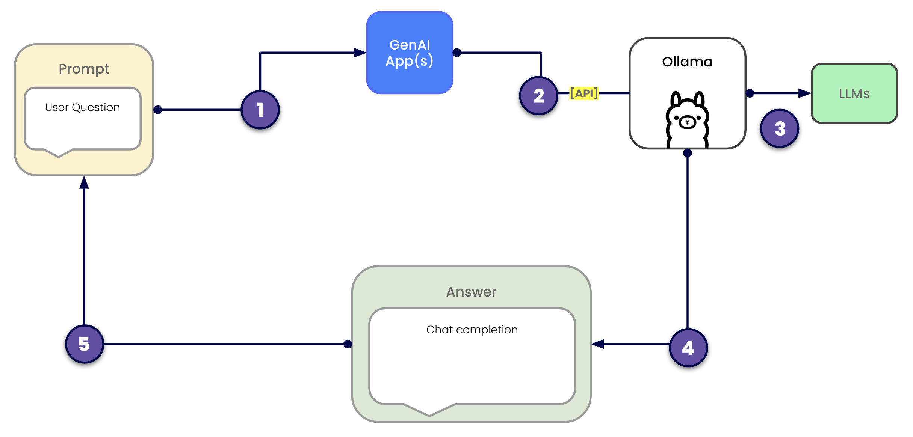

# MySQL & GenAI: Drug Recommendation with Vector Search





This project is a demonstration of how MySQL and its vector field can be leveraged to explore the potential of Generative AI (GenAI) in generating drug recommendations based on specific pathologies.

## Objective

The goal of this demonstration is to import drug data from the OpenFDA API and use an embedding model of type Qwen2.5:0.5b. These embeddings are then submitted to Ollama, which performs a vector search in MySQL to return the most relevant drugs based on the queried pathologies.

🚨 **Attention:** This project is just a demonstration of what can be done with MySQL and AI. Its purpose is purely educational and for demonstration purposes only. It is in no way an application that will diagnose or treat any medical condition, nor provide medication recommendations


## Features


✅ **Data Import:** A Go program extracts drug information related to various pathologies from the OpenFDA API.We retrieve a sample of 50 medications based on the pathology using the following API request on OpenFDA: "'https://api.fda.gov/drug/label.json?search=indications_and_usage:pathology_name AND +exists:openfda.brand_name&limit=50'"

✅ **Embedding Generation:** The Qwen2.5:0.5b model is used to generate vector representations of pathologies.

✅ **Storage in MySQL:** Data is stored in a MySQL database with a vector field for optimized search.

✅ **Vector Search with Ollama:** Queries MySQL to retrieve the most relevant drugs based on the generated embeddings.

✅ **Vector search in Go:** calculate the cosine similarity between the query embedding and those of the selected drugs to find the most relevant ones.

✅ **Creating the Ollama prompt:** use the text fields from the table for the most relevant identified drugs.

✅ **Send:** submit it to Ollama to generate the response

> 📌 I have not decoded the embeddings to create the prompt for Ollama, as I believe it is unnecessary because embeddings are primarily useful for search and similarity comparison. However, once you have identified the relevant drugs, using the original text data for the prompt is a perfectly valid and often preferable approach. I will test by sending the embeddings directly to Ollama with a specific model.



## Vector Storage Definition

Vector storage refers to the method of storing data in a multi-dimensional vector format, which allows for efficient organization and retrieval of information. This approach is particularly beneficial in applications such as artificial intelligence and machine learning, where high-dimensional data representations, or embeddings, are generated for various entities (like images, text, or medications). 

By leveraging vector storage, queries can efficiently search for and retrieve relevant information based on similarity metrics (or [similarity measure](https://en.wikipedia.org/wiki/Similarity_measure)), enabling improved performance in tasks like semantic search or recommendation systems. This method enhances the ability to handle large datasets, facilitates optimized searching, and supports complex analyses, making it an essential component in modern data-driven applications.


## Requirements

- Go (version 1.16 or newer)
- Git
- MySQL server 9.2
- Install Ollama on your computer: [download & install](https://ollama.com/download)

Once Ollama is installed, we'll use this model: qwen2.5:0.5b

## Introduction : Generative AI

Generative AI refers to a set of artificial intelligence techniques capable of generating original content, including text, images, audio, and code. Based on advanced models such as Generative Adversarial Networks (GANs) and transformers (GPT, LLaMA, etc.), this technology enables content automation, decision support, and enhanced human-machine interaction.

With its adaptability and learning capabilities, Generative AI has a wide range of applications, from automated text generation and image synthesis to virtual assistants and digital art creation.

One example of a Generative AI application is chatbots that can answer questions, such as ClaudeAI, Gemini, and ChatGPT. The models used in these applications are often highly complex and require significant computational resources to operate.

> You can absolutely run LLMs on your own computer, and contrary to popular belief, you don’t necessarily need a high-end machine with a powerful GPU. There are lighter models that can run on standard laptops or even on a Raspberry Pi.

To do this, you need to choose a model that matches your needs and available resources, and use software that allows you to run it on your device.
We're going to use **Ollama**.

### Ollama

Ollama is a lightweight framework designed to run large language models (LLMs) efficiently on local devices. It provides an easy way to download, manage, and execute AI models without requiring cloud-based processing. Ollama optimizes models for performance, allowing them to run on standard laptops and even low-power devices like Raspberry Pi.

With a simple command-line interface and built-in model support, Ollama makes it easy for developers to experiment with LLMs locally while maintaining control over their data and resources.

Ollama lets you interact directly with an LLM via a command line (CLI) or REST API. I am interested in using only the REST API for this demonstration.

Ollama does not have a native feature to directly take an embedding vector as input and use it in its response generation. Ollama is designed to accept plain text input, not numerical vectors. However, there are models like  [**mxbai-embed-large**](https://ollama.com/library/mxbai-embed-large) that allow sending embeddings to Ollama.That will be the next step: integrating this model.





## Installation & Usage

I will not detail the installation of MySQL here.We assume that you have a functional instance.

**1. Clone the repository**

```bash

:> git clone https://github.com/colussim/go-mysql-ai.git
:> go-mysql-ai

```


**2. Install Ollama**

First, install Ollama by following the official installation guide  [here](https://ollama.com/download).

Since we are not using a GPU ✊, we will opt for lighter models that can run on standard laptops. We will install the *Qwen2.5:0.5b* model, but other models can also be used, such as:

- **Llama2-7B** : The lightest version of Llama2, but still heavier than Qwen2.5:0.5b.

Quantized versions of *Llama2-7B* : These are compressed versions that are lighter and faster while maintaining good performance.

Other Lightweight Model Options

- **Mistral 7B** : A recent model that offers good performance for its size.

- **TinyLlama** : A very lightweight version (1.1B parameters) based on Llama.

- **BLOOM-560m** : A multilingual model with 560 million parameters.

In general, larger models provide better performance but require more resources.
If your resources allow it, I recommend testing Llama2-7B.

To load the *Qwen2.5:0.5b* model , simply run the following command: 

 
```bash
ollama pull qwen2.5:0.5b

```

**3. Create the Database and Tables**

Next, we need to create a MySQL database and the necessary tables to store pathologies and recommended medications, along with their embeddings.

You can use the SQL scripts in the database directory and modify them as needed:

- **create_db_health.sql**: Creates the database.

- **create_table_medication_vector.sql**: Creates the necessary tables.

- **create_users.sql**: Creates the required database user.


Database Schema :

```sql
-- Ceated Tablespace
CREATE TABLESPACE health_ts 
ADD DATAFILE '/Volumes/DATA/db/health/health_datafile.ibd' 
ENGINE=INNODB;

-- Created database
CREATE DATABASE health;

CREATE TABLE pathologies (
    id INT AUTO_INCREMENT PRIMARY KEY,
    name VARCHAR(255) UNIQUE,
    embedding VECTOR(896) 
) TABLESPACE health_ts;


CREATE TABLE medicationv (
    id INT AUTO_INCREMENT PRIMARY KEY,
    pathologie_id INT,
    drug_name VARCHAR(255),
    inactive_ingredient TEXT,
    purpose TEXT,
    keep_out_of_reach_of_children TEXT,
    warnings TEXT,
    spl_product_data_elements TEXT,
    dosage_and_administration TEXT,
    pregnancy_or_breast_feeding TEXT,
    package_label_principal_display_panel TEXT,
    indications_and_usage TEXT,
    embedding VECTOR(896),  
    CONSTRAINT fk_pathologie FOREIGN KEY (pathologie_id) REFERENCES pathologies(id)
) TABLESPACE health_ts;


```

> 📌 If you change the model, you will probably need to increase the size of the VECTOR field: embedding.


**🧠 Embedding Structure**

Pathology Embedding Format:

- "For this pathology, Description: ..., Symptoms: ..., Treatments: ..."

Medication Embedding Format:

- "For this medication, Indications: ..., Purpose: ..., Dosage: ..., Warning: ..., Package Label: ..."


**4. Configure the Demo**

The first thing to do is to copy the file *config/config.json.tmp* to *config/config.json*.

Modify the file *config/config.json* with your MySQL credentials and the embedding model you want to use. By default, the model is *Qwen2.5:0.5b.*

Example config.json:

```json
{
    "mysql": {
        "user": "health",
        "password": "XXXXX",
        "server": "127.0.0.1",
        "port": "3310",
        "type_auth": "password"
    },
    "pathologie": {
        "file": "config/pathologies.json"
    },
    "model": {
        "name": "qwen2.5:0.5b",
        "prompt": "Please analyze the medications listed below and recommend..."
    },
    "chatbotport": {
        "port": 3001
    }
}


```
You can also define your pathologies in the *config/pathologies.json* file.
Example pathologies.json:

```json
{
    "pathologies": {
        "headache": {
            "description": "Pain located in the head, scalp, or neck.",
            "symptoms": [
                "throbbing pain",
                "sensitivity to light and sound",
                "nausea",
                "vomiting"
            ],
            "treatments": [
                "over-the-counter pain relievers",
                "rest in a dark room",
                "hydration"
            ]
        },
        ........
}

```

**5. Setup Environment**

Run the following command to automatically install all the required modules based on the go.mod and go.sum files:

```bash

:> go mod download

```

## Usage

✅ Run import data :


```bash

:> go run importdbv.go
Import Data...✅ Tables pathologies and medicationv have been cleared.
2025/04/01 15:30:15 ✅ Import completed in 00:03:00
2025/04/01 15:30:15 ✅ Data inserted successfully.

```

✅ Run chatbot :

```bash

:> go run go-mysql-ai.go
INFO[0000] ✅ HTTP service started on port 3001
```

By default, the chatbot is bound to port 3001. You can change the port either in the configuration file (conf/config.json) under the entry *Chatbotport*, or by specifying the port on the command line with the parameter *-port Your_Port*.
To stop the local HTTP service, press the Ctrl+C keys.


Now, please enter your condition in the chat, for example: 'I have a headache...' and Ollama will respond with a list of medications that may address your condition (maximum of 10 medications).

---

📢 I would like to emphasize that this is not a fully developed chatbot, and there is much to be done to improve it. Please keep in mind that we are in a demo environment, and this is just to demonstrate the interaction between the ability to store vector fields in MySQL and to interact with Ollama.

---


## Conclusion

In this demonstration, we showcase how to enhance the knowledge of a large language model (Ollama) to obtain answers to domain-specific questions. By combining the strengths of language models with vector storage in MySQL, you can create advanced applications that go beyond generic responses. This project highlights the potential of integrating AI with structured databases to provide meaningful insights and recommendations tailored to specific health conditions.

---

### Future Features

Implement the **mxbai-embed-large** model to work directly with embeddings.

---

## ✅ Ressources

[MySQL VECTOR Type](https://dev.mysql.com/doc/refman/9.2/en/vector.html)

[MySQL Vector Functions](https://dev.mysql.com/doc/refman/9.2/en/vector-functions.html)

[Ollama](https://ollama.com/)

[Ollama Embedding models](https://ollama.com/blog/embedding-models)

[Ollama API exemple](https://github.com/ollama/ollama/tree/main/api/examples)

[OpenFDA](https://open.fda.gov/)

